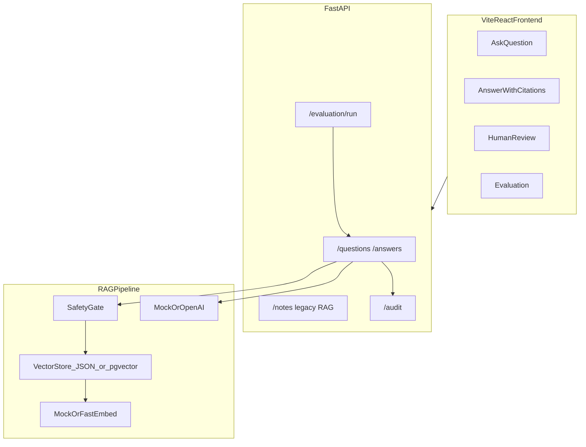
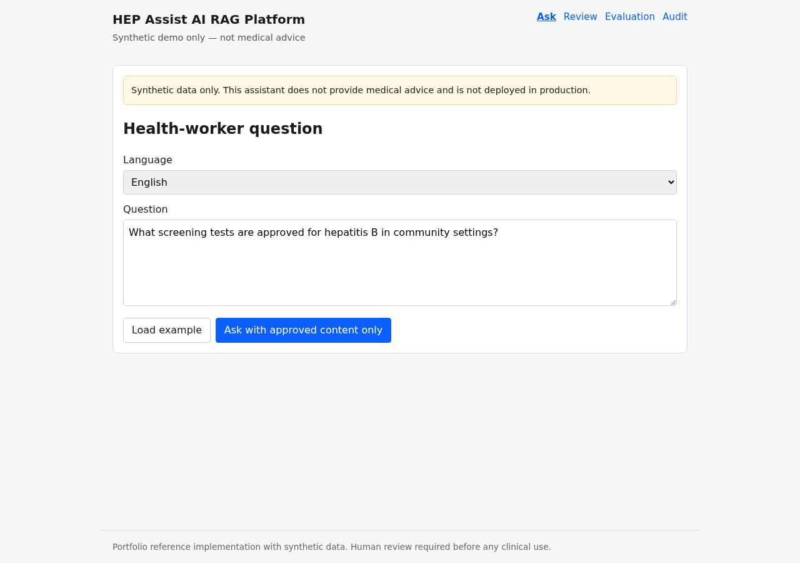
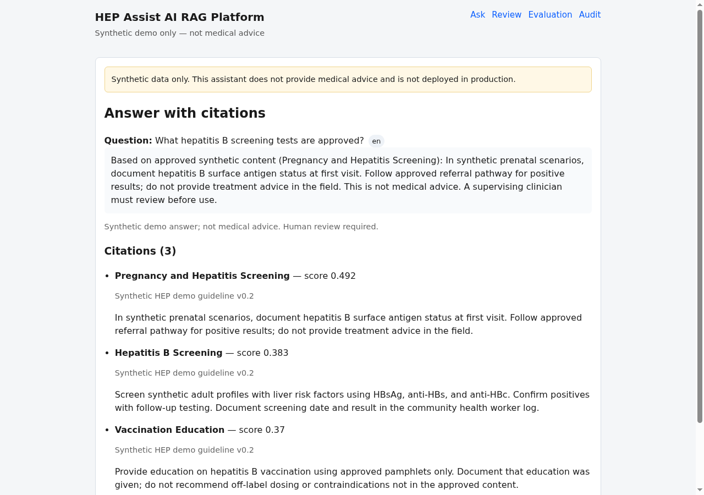
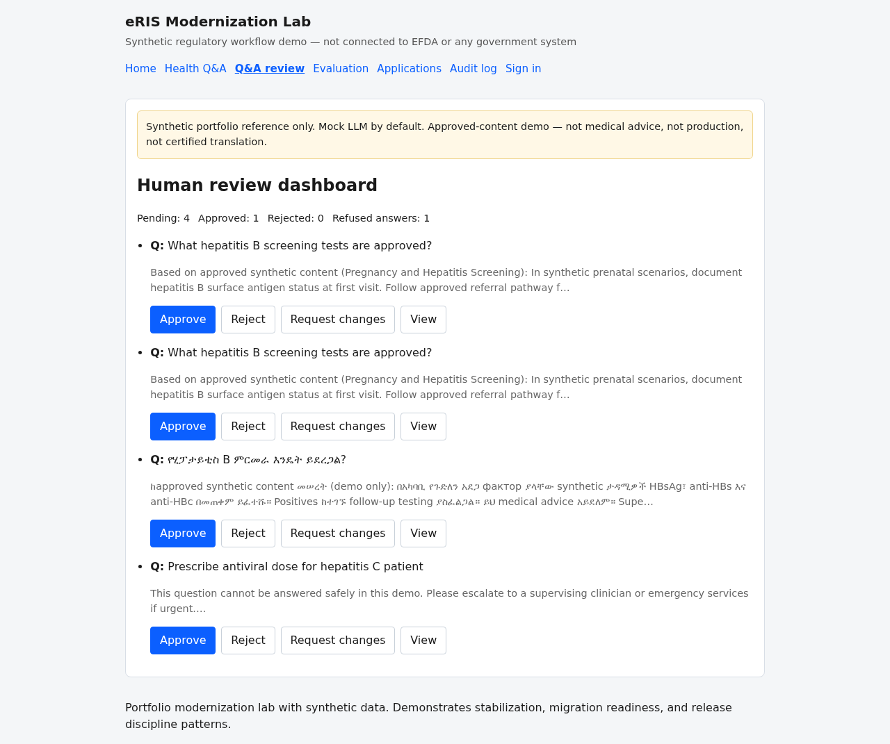

# HEP Assist AI RAG Platform

Production-style **portfolio reference implementation** for a healthcare AI assistant inspired by Last Mile Health / HEP Assist AI requirements. Uses **synthetic data only** — not a deployed clinical system, not medical advice.

[](https://github.com/dawit-Tegegnwork/healthcare-ai-workflow-assistant/actions/workflows/test.yml)

**Target role:** Senior AI Engineer — healthcare AI, RAG, local-language support, safe AI, low-connectivity health-worker workflows.

## What this is (honest framing)

This repo demonstrates architecture, safety patterns, testing, and deployment practices expected in real healthcare AI systems. It is an **interview/demo portfolio project** with:

- Synthetic health-worker questions and approved guideline content only
- Mock LLM by default (no paid API keys required)
- Human-in-the-loop review before trusting any AI output
- Clear disclaimers throughout

It is **not** a production deployment and must not be used with real patient data.

## Quick start (3 minutes)

```bash
docker compose up --build
```

| Service | URL |
|---------|-----|
| React frontend | http://localhost:5173 |
| FastAPI + OpenAPI | http://localhost:8000/docs |
| Health check | http://localhost:8000/health |
| Legacy HTML dashboard | http://localhost:8000/dashboard |

### Local development

**Backend:**

```bash
python -m venv venv && source venv/bin/activate
pip install -r requirements-dev.txt
cp .env.example .env
export MEDIMIND_EMBEDDING_PROVIDER=mock
PYTHONPATH=backend uvicorn main:app --app-dir backend --reload
```

**Frontend:**

```bash
cd frontend && npm install && npm run dev
```

Open http://localhost:5173 — API calls proxy to port 8000.

### Seed synthetic data

```bash
PYTHONPATH=backend python -m app.scripts.seed
# Reseed: PYTHONPATH=backend python -m app.scripts.seed --force
```

### Run tests

```bash
MEDIMIND_EMBEDDING_PROVIDER=mock PYTHONPATH=backend pytest
cd frontend && npm run lint && npm run build
```

## Architecture



See [docs/architecture.md](docs/architecture.md) and [docs/api.md](docs/api.md).

## Features

### Health-worker Q&A (primary)
- Submit questions in English or Amharic examples
- Vector RAG over approved synthetic content
- Answer citations with retrieval scores
- Risk and hallucination flags
- Refuse unsafe or unsupported questions
- Human review: approve / reject / request changes
- Audit log for every AI answer

### Legacy workflow (retained)
- Clinical note extraction with human review
- Keyword guideline search, SOAP draft, preprocessing

### Safety
- Refuse emergency, diagnosis, and prescribing requests
- Approved-content-only mode with retrieval confidence threshold
- Grounding heuristic flags possible hallucinations
- Synthetic data disclaimers on all outputs

### Local-language support
- Amharic example questions and content chunks
- Architecture for STT → language detect → RAG → TTS (documented, not fully built)
- See README section on voice/IVR below

## API endpoints

| Method | Path | Description |
|--------|------|-------------|
| GET | `/health` | Health check |
| POST | `/api/v1/questions` | Submit health-worker question |
| POST | `/api/v1/questions/{id}/answer` | Run RAG + LLM pipeline |
| GET | `/api/v1/questions` | List questions with latest answers |
| GET | `/api/v1/questions/{id}` | Question detail |
| POST | `/api/v1/answers/{id}/review` | Human review action |
| GET | `/api/v1/dashboard/qa-summary` | Q&A review counts |
| POST | `/api/v1/evaluation/run` | Golden test set evaluation |
| GET | `/api/v1/audit` | Audit event list |
| POST | `/api/v1/notes` | Create synthetic note (legacy) |
| POST | `/api/v1/notes/{id}/extract` | Structured extraction (legacy) |
| POST | `/api/v1/guidelines/search` | Guideline search (legacy) |

Full reference: [docs/api.md](docs/api.md)

## Example Q&A workflow

```bash
# Ask a question
curl -X POST http://127.0.0.1:8000/api/v1/questions \
  -H "Content-Type: application/json" \
  -d '{"question_text":"What hepatitis B screening tests are approved?","language":"en"}'

# Generate answer (use question id from response)
curl -X POST http://127.0.0.1:8000/api/v1/questions/{QUESTION_ID}/answer

# Review answer
curl -X POST http://127.0.0.1:8000/api/v1/answers/{ANSWER_ID}/review \
  -H "Content-Type: application/json" \
  -d '{"action":"approve","reviewer_comment":"Demo approval"}'
```

## What this proves for recruiters

- **RAG pipeline design:** chunking, embeddings, vector retrieval, citation display
- **Healthcare safety awareness:** refusal gates, approved-content-only mode, audit trails
- **Human-in-the-loop AI:** review workflow before trusting outputs
- **Full-stack delivery:** FastAPI + PostgreSQL + React + Docker Compose + CI
- **Low-connectivity thinking:** minimal frontend, offline architecture notes
- **Local-language workflow:** Amharic examples with honest limitations documented
- **Testing discipline:** retrieval, API, safety, and audit tests

## Interview talking points

1. **Why approved-content-only?** Health workers in low-resource settings need answers grounded in ministry-approved protocols, not open-ended LLM generation.
2. **How do you handle unsafe questions?** Rule-based pre-checks for emergency/diagnosis/prescribing plus retrieval confidence thresholds before generation.
3. **How would you add Amharic voice/IVR?** Whisper STT → language detect → translate query for retrieval → generate in Amharic → TTS; cache approved chunks offline.
4. **How do you evaluate RAG quality?** Golden question set measuring citation rate, refusal rate, and retrieval scores — with human review as the final gate.
5. **Why mock LLM default?** Portfolio runs without API keys; architecture supports OpenAI-compatible provider via env vars.

## Voice / IVR future architecture

```
Caller (Amharic) → STT (Whisper) → Language detect
  → RAG Q&A (this API) → TTS (Amharic voice) → Audio response
  → Optional SMS fallback with cited excerpt when bandwidth is low
```

Not implemented in this demo; documented for interview discussion.

## Known limitations and next improvements

| Area | Current state | Next step |
|------|---------------|-----------|
| Embeddings | Mock token-hash default; optional `fastembed` | Production sentence-transformers + pgvector index |
| Translation | Amharic examples only, not certified | Integrate NLLB or similar with confidence scoring |
| Auth | None | JWT + role-based access for health workers vs reviewers |
| Migrations | `create_all()` | Alembic migrations |
| Offline | Documented only | Service worker + cached approved chunks |
| FHIR / EHR | Not in scope | FHIR QuestionnaireResponse export |
| Compliance | Portfolio disclaimers | Formal HIPAA / GDPR assessment for real deployment |

## Try live / Run locally

| | |
|---|---|
| **Live demo (legacy API)** | https://healthcare-ai-workflow-assistant.onrender.com/dashboard |
| **API docs** | https://healthcare-ai-workflow-assistant.onrender.com/docs |
| **Local full stack** | `docker compose up --build` — frontend at http://localhost:5173 |

See [docs/RENDER_DEPLOY.md](docs/RENDER_DEPLOY.md) for cloud deployment.

## Optional providers

```bash
# OpenAI-compatible LLM
export OPENAI_API_KEY=sk-...
export OPENAI_MODEL=gpt-4o-mini

# Local embeddings (pip install fastembed)
export MEDIMIND_EMBEDDING_PROVIDER=fastembed
export MEDIMIND_EMBEDDING_MODEL=BAAI/bge-small-en-v1.5
```

## Screenshots

| Ask | Answer | Review |
|-----|--------|--------|
|  |  |  |

Capture locally after `docker compose up --build`. See [docs/screenshots/README.md](docs/screenshots/README.md).

## License

MIT — synthetic demo data only.
