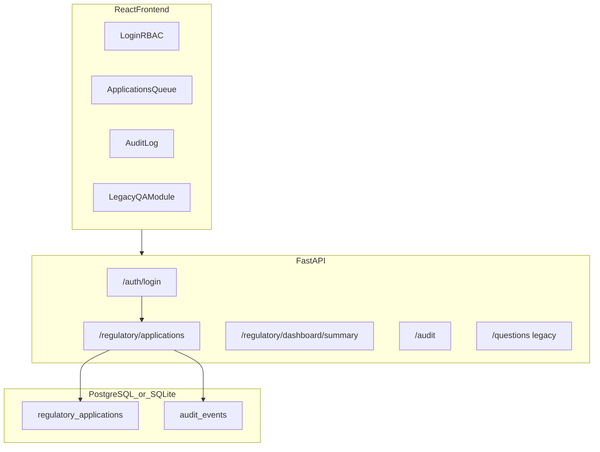

# eRIS Modernization Lab

Production-style **modernization lab** for a legacy regulatory information system workflow — inspired by public-sector digital health and governance programs (Palladium / Data.FI-style roles). Uses **synthetic data only**. This is **not** real eRIS and is **not** connected to EFDA or any government system.

[](https://github.com/dawit-Tegegnwork/hep-assist-ai-rag-platform/actions/workflows/test.yml)

**Target role:** Software engineer / technical lead — regulatory systems modernization, stabilization, migration readiness, release discipline.

## What this is (honest framing)

This repo demonstrates how a long-lived regulatory workflow platform can be **stabilized** and made **migration-ready** while preserving auditability and role separation. It is a **portfolio reference implementation** with:

- Synthetic marketing-authorization-style applications (not real dossiers)
- Enforced workflow states with server-side transition validation
- Role-based access control (applicant, technical reviewer, admin, auditor)
- Audit log entry for every application transition
- Documented release, rollback, and support procedures
- Stabilized legacy Q&A module (health-worker RAG demo) retained for comparison

## Legacy modernization story

### What the old system struggled with

| Pain point | Legacy behavior |
|------------|-----------------|
| Manual review | Spreadsheet queues, no enforced workflow |
| Clarification loop | Email/phone with no system record |
| Auditability | Updates without actor or reason |
| Role separation | Shared accounts, applicants saw internal notes |
| Migration / release | Single cloud tenant, manual deploys, slow rollback |

### What this lab improves

| Capability | Implementation |
|------------|----------------|
| Regulatory workflow | submitted → technical review → clarification → resubmit → approve/reject |
| Stabilization | Invalid transitions rejected with tests |
| Role separation | JWT + RBAC on `/api/v1/regulatory/*` |
| Audit trail | `regulatory.application.*` events per transition |
| Migration readiness | `docs/migration/gcp-to-local-plan.md` |
| Release discipline | `docs/checklists/release.md`, `docs/checklists/rollback.md` |

See [docs/legacy-modernization-assessment.md](docs/legacy-modernization-assessment.md) for the full assessment.

## Quick start (3 minutes)

```bash
docker compose up --build
```

| Service | URL |
|---------|-----|
| React frontend | http://localhost:5173 |
| FastAPI + OpenAPI | http://localhost:8000/docs |
| Health (ready) | http://localhost:8000/health/ready |

### Demo credentials (synthetic)

| Username | Password | Role |
|----------|----------|------|
| `applicant` | `applicant123` | Submit and resubmit applications |
| `reviewer` | `reviewer123` | Technical review and decisions |
| `admin` | `admin123` | Full workflow access |
| `auditor` | `auditor123` | Read-only audit access |

### 5-minute recruiter walkthrough

1. Sign in at http://localhost:5173/login as `reviewer` / `reviewer123`
2. Open **Applications** — review dashboard counts by status
3. Open an application — run **Start technical review** → **Request clarification**
4. Sign in as `applicant` — **Resubmit** with updated dossier
5. Sign in as `reviewer` — **Approve** and verify **Audit trail**

Full script: [docs/DEMO_WALKTHROUGH.md](docs/DEMO_WALKTHROUGH.md)

```bash
chmod +x scripts/demo_regulatory_workflow.sh
./scripts/demo_regulatory_workflow.sh http://127.0.0.1:8000
```

### Local development

**Backend:**

```bash
python -m venv venv && source venv/bin/activate
pip install -r requirements-dev.txt
cp .env.example .env
export MEDIMIND_EMBEDDING_PROVIDER=mock
PYTHONPATH=backend uvicorn main:app --app-dir backend --reload
```

**Frontend:**

```bash
cd frontend && npm install && npm run dev
```

### Seed synthetic data

```bash
PYTHONPATH=backend python -m app.scripts.seed
# Reseed: PYTHONPATH=backend python -m app.scripts.seed --force
```

### Run tests

```bash
MEDIMIND_EMBEDDING_PROVIDER=mock PYTHONPATH=backend pytest
cd frontend && npm run lint && npm run build
```

## Architecture



See [docs/architecture.md](docs/architecture.md), [docs/api.md](docs/api.md), and [docs/operations/support-runbook.md](docs/operations/support-runbook.md).

## Regulatory workflow API

| Method | Path | Auth | Description |
|--------|------|------|-------------|
| POST | `/api/v1/auth/login` | No | Obtain JWT |
| GET | `/api/v1/auth/me` | Yes | Current user |
| POST | `/api/v1/regulatory/applications` | applicant | Submit application |
| GET | `/api/v1/regulatory/applications` | Yes | List applications |
| GET | `/api/v1/regulatory/applications/{id}` | Yes | Application detail |
| POST | `/api/v1/regulatory/applications/{id}/transition` | reviewer | State transition |
| POST | `/api/v1/regulatory/applications/{id}/resubmit` | applicant | Resubmit after clarification |
| GET | `/api/v1/regulatory/dashboard/summary` | reviewer/auditor | Status counts |
| GET | `/api/v1/regulatory/applications/{id}/audit` | Yes | Per-application audit trail |
| GET | `/api/v1/audit` | No | Global audit log (legacy) |

### Example workflow (curl)

```bash
TOKEN=$(curl -s -X POST http://127.0.0.1:8000/api/v1/auth/login \
  -H "Content-Type: application/json" \
  -d '{"username":"applicant","password":"applicant123"}' | jq -r .access_token)

curl -X POST http://127.0.0.1:8000/api/v1/regulatory/applications \
  -H "Authorization: Bearer $TOKEN" \
  -H "Content-Type: application/json" \
  -d '{
    "product_name": "Synthetic Product XR-200",
    "application_type": "marketing_authorization",
    "applicant_organization": "Synthetic Pharma Ltd",
    "dossier_summary": "Demo dossier for regulatory workflow testing with sufficient detail."
  }'
```

## Documentation index

| Document | Purpose |
|----------|---------|
| [legacy-modernization-assessment.md](docs/legacy-modernization-assessment.md) | Legacy pain points vs. lab improvements |
| [migration/gcp-to-local-plan.md](docs/migration/gcp-to-local-plan.md) | GCP-to-local migration phases |
| [checklists/release.md](docs/checklists/release.md) | Pre/post release checklist |
| [checklists/rollback.md](docs/checklists/rollback.md) | Rollback procedure |
| [operations/support-runbook.md](docs/operations/support-runbook.md) | Common issues and fixes |
| [DEMO_WALKTHROUGH.md](docs/DEMO_WALKTHROUGH.md) | Recruiter demo path |

## Stabilized legacy modules

The health-worker Q&A RAG module remains available as a comparison point for incremental modernization:

- `POST /api/v1/questions` — synthetic health-worker Q&A
- `POST /api/v1/answers/{id}/review` — human review (legacy pattern)
- `./scripts/demo_workflow.sh` — original Q&A demo script

## What this proves for recruiters

- **Regulatory workflow design** — state machine, clarification loop, decision audit
- **Stabilization** — RBAC, invalid transition rejection, tested dashboard counts
- **Migration readiness** — documented cloud-to-container migration plan
- **Release discipline** — checklists, smoke scripts, support runbook
- **Full-stack delivery** — FastAPI + PostgreSQL + React + Docker + CI
- **Honest scope** — synthetic data, clear disclaimers, no government claims

## Known limitations

| Area | Current state | Next step |
|------|---------------|-----------|
| Auth | Demo JWT users | Enterprise OIDC / IdP |
| Migrations | `create_all()` | Alembic |
| Document storage | Filename list only | Object store + checksums |
| Legacy Q&A | Open endpoints | Optional auth alignment |
| Compliance | Portfolio disclaimers | Formal assessment for real deployment |

## License

MIT — synthetic demo data only.
