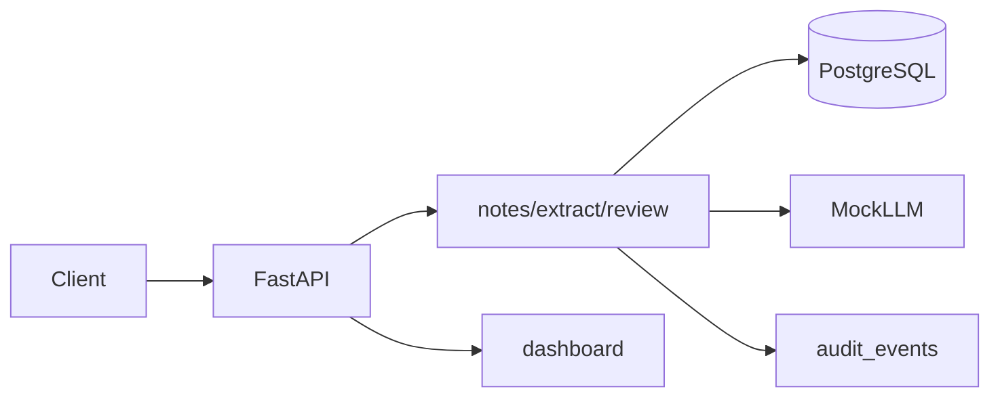
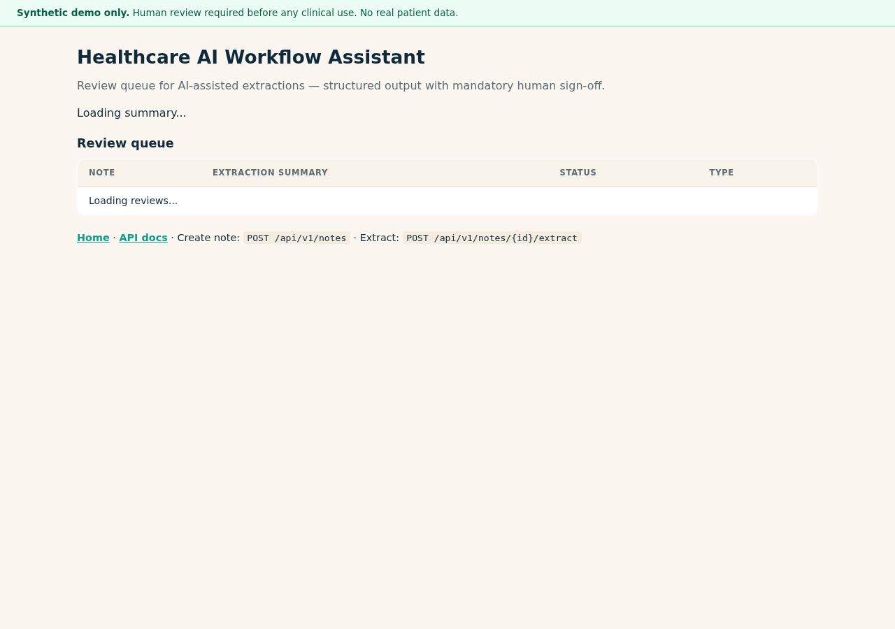
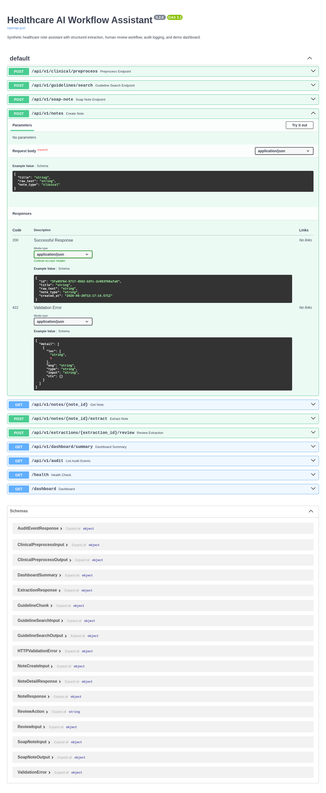

# Healthcare AI Workflow Assistant

Synthetic healthcare note assistant with structured AI extraction, human review workflow, audit logging, and a demo dashboard. **Synthetic demo data only** — not for real patient data or clinical decision-making.

[](https://github.com/dawit-Tegegnwork/healthcare-ai-workflow-assistant/actions/workflows/test.yml)

**Requirements:** Python 3.12+

## Demo scenario (3–5 minutes)

1. `docker compose up --build` — demo notes auto-seed on startup
2. Open http://127.0.0.1:8000/dashboard — review note list and review statuses
3. Open http://127.0.0.1:8000/docs — run extract + review on a pending note
4. `GET /api/v1/audit` — confirm audit events

## What it demonstrates

- FastAPI + Pydantic APIs with OpenAPI docs
- SQLModel persistence (PostgreSQL or SQLite)
- Mock LLM structured extraction (optional OpenAI-compatible provider)
- Human review: approve / reject / request changes
- Audit log stored in database
- Docker Compose, seed script, pytest coverage
- Legacy demo endpoints: preprocessing, guideline RAG, SOAP draft

## Architecture

See [docs/architecture.md](docs/architecture.md).



## Screenshots

| Dashboard | API docs | Workflow endpoints |
|-----------|----------|-------------------|
|  |  |  |

## Quick start

```bash
python -m venv venv
source venv/bin/activate
pip install -r requirements-dev.txt
cp .env.example .env
PYTHONPATH=backend uvicorn main:app --app-dir backend --reload
```

Open:
- API docs: http://127.0.0.1:8000/docs
- Dashboard: http://127.0.0.1:8000/dashboard

### Seed demo data

```bash
PYTHONPATH=backend python -m app.scripts.seed
```

### Docker Compose

```bash
docker compose up --build
PYTHONPATH=backend python -m app.scripts.seed
```

## API endpoints

| Method | Path | Description |
|--------|------|-------------|
| GET | `/health` | Health check |
| POST | `/api/v1/notes` | Create synthetic note |
| GET | `/api/v1/notes/{id}` | Note + latest extraction |
| POST | `/api/v1/notes/{id}/extract` | Run structured extraction |
| POST | `/api/v1/extractions/{id}/review` | Human review action |
| GET | `/api/v1/dashboard/summary` | Pending/approved/rejected counts |
| GET | `/api/v1/audit` | Audit event list |
| POST | `/api/v1/clinical/preprocess` | Text preprocessing |
| POST | `/api/v1/guidelines/search` | Synthetic guideline RAG |
| POST | `/api/v1/soap-note` | SOAP draft (demo) |
| GET | `/dashboard` | HTML demo dashboard |

## Example workflow

```bash
# Create note
curl -X POST http://127.0.0.1:8000/api/v1/notes \
  -H "Content-Type: application/json" \
  -d '{"title":"Synthetic follow-up","raw_text":"Synthetic patient with fatigue and hepatitis screening history.","note_type":"clinical"}'

# Extract (use note id from response)
curl -X POST http://127.0.0.1:8000/api/v1/notes/{NOTE_ID}/extract

# Approve extraction
curl -X POST http://127.0.0.1:8000/api/v1/extractions/{EXTRACTION_ID}/review \
  -H "Content-Type: application/json" \
  -d '{"action":"approve","reviewer_comment":"Demo approval"}'
```

## Tests

```bash
PYTHONPATH=backend pytest
```

## Safety scope

Portfolio demo only. Not a medical device. Does not diagnose or treat. Use synthetic data only. All AI outputs require human review.

## Try live / Run locally

| | |
|---|---|
| **Live demo** | Deploy via [Render](docs/RENDER_DEPLOY.md) (free tier) or run locally below |
| **Local** | `docker compose up --build` then seed demo data |

See [docs/RENDER_DEPLOY.md](docs/RENDER_DEPLOY.md) for one-click cloud deployment.

## Optional OpenAI provider

Set `OPENAI_API_KEY` (and optionally `OPENAI_BASE_URL`, `OPENAI_MODEL`). Mock provider is used when unset.

## This project demonstrates (for recruiters)

FastAPI, PostgreSQL/SQLModel, AI workflow design, structured extraction, human-in-the-loop review, audit-friendly records, Docker, and healthcare data safety awareness.
