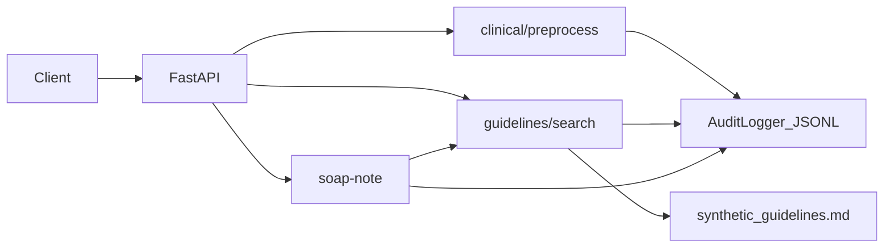

# MediMind HEP Assist AI

Minimal healthcare AI backend portfolio MVP for FastAPI roles. The app uses only synthetic demo data and does not contain patient data or production clinical claims.

[](https://github.com/dawit-Tegegnwork/medimind-hep-assist-ai/actions/workflows/test.yml)

## What it shows

- FastAPI service with typed Pydantic request and response models
- Clinical text preprocessing with simple identifier redaction and abbreviation normalization
- Keyword-based retrieval over synthetic hepatitis guideline snippets loaded from markdown
- SOAP note draft endpoint with safety disclaimer
- Audit logging with JSONL fallback (Postgres URL configurable; durable DB writes deferred)
- Docker Compose with API and PostgreSQL
- Pytest coverage for main API workflows

## Architecture



## Run locally

```bash
python -m venv venv
source venv/bin/activate
pip install -r requirements-dev.txt
cp .env.example .env
PYTHONPATH=backend uvicorn main:app --app-dir backend --reload
```

Open `http://127.0.0.1:8000/docs`.

## Run with Docker Compose

```bash
docker compose up --build
```

The API will be available on `http://127.0.0.1:8000`.

## Test

```bash
PYTHONPATH=backend pytest
```

## Example requests

```bash
curl -X POST http://127.0.0.1:8000/api/v1/clinical/preprocess \
  -H "Content-Type: application/json" \
  -d '{"text":"Synthetic pt hx of SOB. Call +1 555 222 3333."}'
```

```bash
curl -X POST http://127.0.0.1:8000/api/v1/guidelines/search \
  -H "Content-Type: application/json" \
  -d '{"query":"HCV RNA confirmation","limit":2}'
```

```bash
curl -X POST http://127.0.0.1:8000/api/v1/soap-note \
  -H "Content-Type: application/json" \
  -d '{"chief_complaint":"Fatigue","history":"Synthetic patient reports hepatitis exposure.","vitals":{"hr":82},"problems":["hepatitis screening"]}'
```

## Safety scope

This is a portfolio backend demo. It is not a medical device, does not diagnose or treat disease, and should not be used with real patient data.

## Limitations

- Guideline retrieval uses keyword scoring, not vector embeddings or an LLM
- Audit events write to JSONL even when `MEDIMIND_DATABASE_URL` is set
- All clinical content is synthetic and for demonstration only
