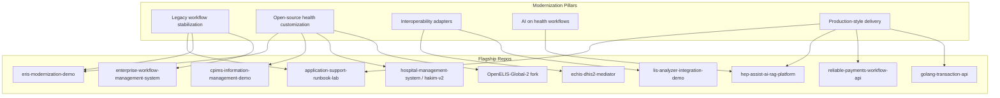

# Portfolio Modernization Strategy

**Owner:** Dawit Tegegnwork Wubale  
**GitHub:** https://github.com/dawit-Tegegnwork  
**Portfolio site:** https://dawit-tegegnwork.github.io/portfolio-website/  
**Updated:** 2026-07-03  
**Author:** Portfolio Architect review (synthetic-data, honesty-first framing)

---

## Executive summary

Dawit's GitHub portfolio has already moved beyond “greenfield demo apps” toward **production-style reference implementations** with Docker, CI, health checks, audit logs, and recruiter-friendly READMEs. The next evolution is to present the work as a coherent **legacy system modernization and customization portfolio** — the kind of engineer international NGOs, digital-health implementers, and healthcare-AI teams hire when they need someone who can stabilize existing workflows, integrate open-source health platforms, and add AI safely on top.

**Core positioning (use everywhere):**

> Portfolio labs, modernization demos, interoperability adapters, deployment runbooks, and synthetic-data systems that show how I would modernize and extend real health and NGO platforms — without claiming employer production work or authorship of OpenMRS, OpenELIS, DHIS2, or Bahmni.

**Truth rules (non-negotiable):**

| Rule | Wording to use | Wording to avoid |
|------|----------------|------------------|
| Employment | “portfolio reference,” “synthetic demo,” “inspired by” | “deployed at,” “built for [employer],” “national rollout” |
| Open-source platforms | “adapter,” “mediator demo,” “fork exploration,” “integration prototype” | “I built OpenMRS/DHIS2/OpenELIS” |
| Data | “synthetic data only” | “real patient/case/beneficiary data” |
| AI | “human-in-the-loop,” “approved-content-only,” “audit trail” | “clinical decision support,” “diagnosis” |

---

## Audit snapshot (2026-07-03)

### Repository inventory

| Tier | Count | Action |
|------|-------|--------|
| **A — Flagship modernization demos** | 10 | Promote, pin, keep polished |
| **B — Supporting / secondary** | 6 | Reframe or consolidate |
| **C — WIP / merge candidates** | 4 | Finish or merge into A-tier |
| **D — Archive / deprioritize** | 12+ | Archive, make private, or leave unlinked |
| **Meta — Index & profile** | 3 | Update cross-links |

### Maturity scorecard (A-tier)

| Repo | CI | Docker | Tests | Live demo | Screenshots | Modernization framing |
|------|:--:|:------:|:-----:|:---------:|:-----------:|:---------------------:|
| [hep-assist-ai-rag-platform](https://github.com/dawit-Tegegnwork/hep-assist-ai-rag-platform) | ✅ | ✅ | ~38 | Render | ✅ | Strong |
| [eris-modernization-demo](https://github.com/dawit-Tegegnwork/eris-modernization-demo) | ✅ | ✅ | Yes | Local | Partial | Strong |
| [echis-dhis2-mediator](https://github.com/dawit-Tegegnwork/echis-dhis2-mediator) | Partial | ✅ | Partial | Local | Needed | Strong |
| [lis-analyzer-integration-demo](https://github.com/dawit-Tegegnwork/lis-analyzer-integration-demo) | ✅ | — | Yes | CLI | Artifacts | Strong |
| [cpims-information-management-demo](https://github.com/dawit-Tegegnwork/cpims-information-management-demo) | ✅ | ✅ | 12 | Render | Needed | Strong |
| [application-support-runbook-lab](https://github.com/dawit-Tegegnwork/application-support-runbook-lab) | ✅ | ✅ | 7 | Render | Needed | Strong |
| [enterprise-workflow-management-system](https://github.com/dawit-Tegegnwork/enterprise-workflow-management-system) | ✅ | ✅ | 9 | Render | Needed | Reframe |
| [reliable-payments-workflow-api](https://github.com/dawit-Tegegnwork/reliable-payments-workflow-api) | ✅ | ✅ | Yes | Local | Needed | Strong |
| [golang-transaction-api](https://github.com/dawit-Tegegnwork/golang-transaction-api) | ✅ | ✅ | 10 | Render | ✅ | Reframe |
| [portfolio-website](https://github.com/dawit-Tegegnwork/portfolio-website) | ✅ | — | Build | GitHub Pages | Partial | Update copy |

### Critical cleanup issues

1. **Duplicate HEP Assist repos** — Three names point at the same project:
   - Canonical: https://github.com/dawit-Tegegnwork/hep-assist-ai-rag-platform
   - Legacy redirects still public: `healthcare-ai-workflow-assistant`, `medimind-hep-assist-ai`
   - **Action:** Archive legacy repos with README redirect to canonical; update all portfolio links.

2. **Stale cross-links** — `healthcare-integration-portfolio`, `dawit-tegegnwork`, and `portfolio-website` still reference `healthcare-ai-workflow-assistant`.

3. **WIP fragmentation** — `hospital-management-system`, `hakim-v2`, `emr-module-demo`, and `pacs-dicom-workflow-tool` overlap as EMR modernization stories. Consolidate narrative under one “facility EMR modernization lab.”

4. **Learning repos visible** — `fowl-farm-nexus`, `kuul`, `microservices-platform`, `real-time-analytics`, ALX/10 Academy repos dilute the modernization story. Archive or unpin.

---

## Portfolio pillars → repo mapping

---

## Recommended GitHub pin order (6 slots)

| # | Repo | Why pin |
|---|------|---------|
| 1 | [hep-assist-ai-rag-platform](https://github.com/dawit-Tegegnwork/hep-assist-ai-rag-platform) | Healthcare AI + RAG + human review — highest differentiation |
| 2 | [eris-modernization-demo](https://github.com/dawit-Tegegnwork/eris-modernization-demo) | Regulatory / government IMS modernization — Palladium, Data.FI, EFDA-adjacent |
| 3 | [echis-dhis2-mediator](https://github.com/dawit-Tegegnwork/echis-dhis2-mediator) | OpenHIM + DHIS2 interoperability — digital health implementer signal |
| 4 | [cpims-information-management-demo](https://github.com/dawit-Tegegnwork/cpims-information-management-demo) | NGO child-protection IMS — UNICEF/CPIMS-adjacent |
| 5 | [application-support-runbook-lab](https://github.com/dawit-Tegegnwork/application-support-runbook-lab) | Legacy stabilization + L2/L3 support credibility |
| 6 | [lis-analyzer-integration-demo](https://github.com/dawit-Tegegnwork/lis-analyzer-integration-demo) | LIS/LIMS integration — OpenELIS ecosystem adjacent |

**Rotate in for backend-heavy roles:** `reliable-payments-workflow-api`, `golang-transaction-api`, `enterprise-workflow-management-system`.

---

## Per-repo modernization cards

---

### 1. hep-assist-ai-rag-platform

| Field | Detail |
|-------|--------|
| **URL** | https://github.com/dawit-Tegegnwork/hep-assist-ai-rag-platform |
| **Target roles** | Healthcare AI Engineer · Digital Health Software Engineer · Senior Backend (health) · NGO health-tech roles (Last Mile Health, Palladium, PATH-adjacent) |
| **System / problem represented** | Community health worker decision-support layer on top of **approved ministry guidelines** — low-connectivity, local-language, safety-critical Q&A (HEP / CHW programs) |
| **Modernization story** | Instead of bolting a chatbot onto paper protocols, this demo shows **RAG over approved content**, refusal gates, citation display, human review, and audit logging — the safe way to add AI to existing CHW workflows |
| **What Dawit improved (honest)** | Full-stack reference: FastAPI + PostgreSQL/pgvector + React, mock/real embedding providers, golden-set evaluation, legacy note-extraction workflow retained, Docker + CI + Render deploy, demo script, screenshots |
| **Still needs implementation** | JWT/RBAC, Alembic migrations, offline service-worker cache, Amharic STT/TTS path, FHIR QuestionnaireResponse export, consolidate duplicate repo names |
| **README wording (lead paragraph)** | *“Portfolio reference implementation for adding safe, human-reviewed RAG Q&A on top of approved community-health guidelines. Synthetic data only — not a deployed clinical system. Demonstrates how I would extend existing CHW programs with AI without replacing clinician judgment.”* |
| **Screenshots needed** | ✅ Ask / Answer / Review — refresh after UI changes; add Evaluation and Audit Log screens |
| **Docs needed** | ✅ architecture.md, api.md, PRODUCTION.md — add `docs/MODERNIZATION_CONTEXT.md` linking to CHW program patterns |
| **Tests needed** | ✅ ~38 tests — add auth tests when JWT lands; expand golden-set coverage |

**Rename / reframe:** ✅ Already renamed. Archive `healthcare-ai-workflow-assistant` and `medimind-hep-assist-ai`.

---

### 2. eris-modernization-demo

| Field | Detail |
|-------|--------|
| **URL** | https://github.com/dawit-Tegegnwork/eris-modernization-demo |
| **Target roles** | Digital Health Software Engineer · IMS Modernization · Regulatory systems (EFDA/eRIS-adjacent) · Palladium / Data.FI / public-sector health IT |
| **System / problem represented** | Legacy **electronic Regulatory Information System (eRIS)**-style application intake, multi-role review, and audit — paper/spreadsheet workflows moving to a governed web platform |
| **Modernization story** | Stabilizes a regulatory submission pipeline with role-based queues, status lifecycle, immutable audit log, and SPA + API separation — the pattern NGOs and ministries use when modernizing legacy permit/registration systems |
| **What Dawit improved (honest)** | End-to-end synthetic demo: React SPA, FastAPI, JWT roles (applicant/reviewer/admin/auditor), dashboard, application detail + review actions, audit log, Docker Compose, CI, demo accounts |
| **Still needs implementation** | Document upload simulation, email notification adapter, PDF export of audit trail, OpenAPI contract tests, deployment runbook for ministry-style environments |
| **README wording** | *“Synthetic eRIS-style regulatory workflow modernization demo. Portfolio reference only — not connected to government eRIS. Shows how I would migrate legacy permit/review workflows to a role-governed API + SPA with full auditability.”* |
| **Screenshots needed** | Dashboard, Application detail, Review action, Audit log (4 minimum) |
| **Docs needed** | `docs/ROLE_MATRIX.md`, `docs/STATUS_LIFECYCLE.md`, `docs/DEPLOYMENT_RUNBOOK.md` |
| **Tests needed** | Role transition tests, audit immutability tests, invalid status transition rejection |

---

### 3. echis-dhis2-mediator

| Field | Detail |
|-------|--------|
| **URL** | https://github.com/dawit-Tegegnwork/echis-dhis2-mediator |
| **Target roles** | Health Interoperability Engineer · OpenHIM / HIE · DHIS2 Implementer · Digital Health Integration Consultant |
| **System / problem represented** | Community health aggregate reports (eCHIS-style) must reach **DHIS2** HMIS without point-to-point coupling |
| **Modernization story** | Replaces brittle direct integrations with an **OpenHIM mediator**: validation → transform → optional AI quality flag → DHIS2 dataValueSet — centralized orchestration and transaction logging |
| **What Dawit improved (honest)** | Runnable Docker stack (OpenHIM core + console + mediator), synthetic HEW payloads, validator/transformer pipeline, DHIS2 play sandbox client, optional Claude enrichment for data-quality scoring, orchestration metadata |
| **Still needs implementation** | GitHub Actions CI, integration test suite, README screenshots of OpenHIM console, retry/dead-letter channel, FHIR Bundle adapter variant |
| **README wording** | *“OpenHIM mediator portfolio prototype: synthetic eCHIS-style community health reports → validation → DHIS2-compatible payloads. Not an official national eCHIS connector. Demonstrates HIE modernization patterns I would use on real DHIS2/OpenHIM deployments.”* |
| **Screenshots needed** | OpenHIM Console orchestration view, mediator logs, DHIS2 payload example, architecture diagram export |
| **Docs needed** | `docs/CHANNEL_CONFIG.md`, `docs/SYNTHETIC_PAYLOADS.md`, `docs/TROUBLESHOOTING.md` |
| **Tests needed** | Validator unit tests, transformer golden files, mock DHIS2 integration test in CI |

---

### 4. lis-analyzer-integration-demo

| Field | Detail |
|-------|--------|
| **URL** | https://github.com/dawit-Tegegnwork/lis-analyzer-integration-demo |
| **Target roles** | LIS/LIMS Integration Engineer · OpenELIS ecosystem · Laboratory informatics · Health interface analyst |
| **System / problem represented** | Analyzer instruments emit CSV/HL7-like results that must be **validated, code-mapped, and normalized** before entering a LIS (OpenELIS-style) |
| **Modernization story** | Shows the adapter layer between instrument middleware and LIS — mapping machine codes, rejecting bad units, flagging abnormal values, emitting LIS-ready JSON with validation artifacts |
| **What Dawit improved (honest)** | CLI demo tool, sample CSV/JSON, code mapping table, structured validation errors, processing summary, CI tests, clear artifact outputs |
| **Still needs implementation** | Docker wrapper, HL7 v2 ORU^R01 sample path, REST webhook receiver, link doc to OpenELIS fork exploration, dashboard HTML for validation queue |
| **README wording** | *“LIS-to-analyzer integration portfolio lab with synthetic lab results only. Demonstrates validation, code mapping, and LIS-ready payload generation — the adapter layer I would build alongside OpenELIS or similar LIMS platforms.”* |
| **Screenshots needed** | Terminal run with summary counts; optional simple validation dashboard |
| **Docs needed** | `docs/CODE_MAPPING.md`, `docs/VALIDATION_RULES.md`, `docs/OPENELIS_CONTEXT.md` (explicit: fork exploration, not authorship) |
| **Tests needed** | ✅ Present — add HL7 fixture tests when implemented |

---

### 5. cpims-information-management-demo

| Field | Detail |
|-------|--------|
| **URL** | https://github.com/dawit-Tegegnwork/cpims-information-management-demo |
| **Target roles** | NGO Information Management · MEAL / IM Officer (technical) · Child Protection IMS · UNICEF / humanitarian data roles |
| **System / problem represented** | **CPIMS-style** case management — registration, completeness, duplicates, status lifecycle, reporting |
| **Modernization story** | Many NGOs run legacy spreadsheets or aging CPIMS deployments with data-quality pain. This demo shows API-first case records, completeness scoring, duplicate detection, CSV import/export, and ops dashboard |
| **What Dawit improved (honest)** | FastAPI + dashboard, synthetic cases, data-quality report endpoint, status lifecycle validation, Docker + CI + Render deploy |
| **Still needs implementation** | Role-based access, case merge workflow UI, anonymization export, PRIMERO/CPIMS field-mapping doc (conceptual only) |
| **README wording** | *“Synthetic CPIMS-style information management modernization demo. Portfolio reference for NGO case-management data quality — not a deployed government or UNICEF system.”* |
| **Screenshots needed** | Dashboard with completeness scores, data-quality report, case detail |
| **Docs needed** | `docs/CASE_LIFECYCLE.md`, `docs/DATA_QUALITY_RULES.md`, `docs/NGO_DEPLOYMENT_NOTES.md` |
| **Tests needed** | ✅ 12 tests — add duplicate-merge and CSV round-trip tests |

---

### 6. application-support-runbook-lab

| Field | Detail |
|-------|--------|
| **URL** | https://github.com/dawit-Tegegnwork/application-support-runbook-lab |
| **Target roles** | Application Support Engineer · L2/L3 Health IT Support · DevOps-adjacent support · Implementation specialist |
| **System / problem represented** | **Legacy enterprise health/NGO application** in production — incidents, UAT, releases, SQL data checks, vendor escalation |
| **Modernization story** | Before rewriting a system, teams need stabilized operations. This repo pairs **runbook documentation** with a triage API/board and synthetic data-health scripts — the support layer that keeps legacy systems running during modernization |
| **What Dawit improved (honest)** | Runbook markdown library, FastAPI ticket tracker, `/board` triage UI, `data_health_check.py`, Docker + CI + Render |
| **Still needs implementation** | Link runbooks to specific demo systems (eRIS, CPIMS), SLA timer fields, post-deploy smoke-test script, screenshot of triage board |
| **README wording** | *“Application support and legacy workflow stabilization lab. Synthetic incidents and runbooks showing how I triage, document, and validate data during IMS/EMR modernization programs — no employer-confidential content.”* |
| **Screenshots needed** | Triage board (INC-240601), landing page, data health check terminal output |
| **Docs needed** | Cross-link `runbooks/` to other portfolio demos; `docs/INCIDENT_SEVERITY_MATRIX.md` |
| **Tests needed** | ✅ 7 tests — add board HTML smoke test |

---

### 7. enterprise-workflow-management-system

| Field | Detail |
|-------|--------|
| **URL** | https://github.com/dawit-Tegegnwork/enterprise-workflow-management-system |
| **Target roles** | Backend Software Engineer · Workflow/BPM modernization · Enterprise health IT (approvals, procurement, clinical admin) |
| **System / problem represented** | **Legacy approval workflows** (email + spreadsheets) for requests, leave, procurement, or clinical admin approvals |
| **Modernization story** | Replaces ad-hoc approval chains with JWT + RBAC, state machine, audit history, CSV export — the API backbone NGOs and hospitals add before replacing a full BPM suite |
| **What Dawit improved (honest)** | JWT auth, 4 roles, seeded requests, status history, audit log, CSV export, Docker + CI + Render |
| **Still needs implementation** | Reframe README from “generic enterprise” to “legacy approval workflow modernization”; add webhook notification adapter; manager delegation rules |
| **README wording** | *“Legacy approval workflow modernization demo. Synthetic requests only. Shows how I would replace email/spreadsheet approval chains with auditable RBAC APIs during enterprise or health-facility system upgrades.”* |
| **Screenshots needed** | Dashboard counts, request detail with history, approve/reject flow |
| **Docs needed** | `docs/WORKFLOW_STATE_MACHINE.md`, `docs/RBAC_MATRIX.md` |
| **Tests needed** | ✅ 9 tests — add CSV export content assertions |

---

### 8. reliable-payments-workflow-api

| Field | Detail |
|-------|--------|
| **URL** | https://github.com/dawit-Tegegnwork/reliable-payments-workflow-api |
| **Target roles** | Backend Engineer (fintech/NGO payments) · Cash transfer systems · GiveDirectly / mobile money / humanitarian payments adjacent |
| **System / problem represented** | **Legacy payment/disbursement workflows** — wallet balances, idempotent transfers, pending withdrawal review, reconciliation |
| **Modernization story** | Humanitarian and fintech programs modernize from manual ledgers to API-first wallets with idempotency, audit trails, and admin approval for high-value payouts |
| **What Dawit improved (honest)** | Java Spring Boot, PostgreSQL cents-based ledger, idempotency keys, JWT + `@PreAuthorize`, audit events, reconciliation report, Docker + CI |
| **Still needs implementation** | Screenshots, Render deploy, link to golang-transaction-api as “same pattern, different stack”, beneficiary KYC stub |
| **README wording** | *“Synthetic cash-transfer / wallet workflow modernization demo (Java Spring Boot). Portfolio reference for idempotent payment APIs and audit trails — not a live banking or NGO disbursement system.”* |
| **Screenshots needed** | API docs, reconciliation report JSON, withdrawal pending review flow |
| **Docs needed** | ✅ architecture.md, data-model.md — add `docs/CASH_TRANSFER_CONTEXT.md` |
| **Tests needed** | Idempotency replay tests, concurrent transfer tests |

---

### 9. golang-transaction-api

| Field | Detail |
|-------|--------|
| **URL** | https://github.com/dawit-Tegegnwork/golang-transaction-api |
| **Target roles** | Go Backend Engineer · Platform/API Engineer · Payment ledger microservice roles |
| **System / problem represented** | Same class of problem as `reliable-payments-workflow-api` — **transaction-safe wallet API** |
| **Modernization story** | Demonstrates the same financial ledger modernization patterns in Go: row locking, idempotency, append-only audit — useful when teams standardize on Go microservices |
| **What Dawit improved (honest)** | Go 1.22 API, PostgreSQL, auto-seed, `/audit`, landing page, Docker + CI + Render |
| **Still needs implementation** | Reframe README toward NGO cash-transfer context; cross-link Java sibling repo; admin approval queue like Java version |
| **README wording** | *“Go implementation of a synthetic wallet/ledger modernization demo. Complements my Java payments workflow project — shows transaction-safe API patterns for cash-transfer and mobile-wallet integrations.”* |
| **Screenshots needed** | ✅ landing.png — add audit log screenshot |
| **Docs needed** | `docs/IDEMPOTENCY.md`, cross-link to reliable-payments-workflow-api |
| **Tests needed** | ✅ 10 tests |

---

### 10. hospital-management-system (+ hakim-v2 consolidation)

| Field | Detail |
|-------|--------|
| **URL** | https://github.com/dawit-Tegegnwork/hospital-management-system · https://github.com/dawit-Tegegnwork/hakim-v2 (archived) |
| **Target roles** | EMR customization · Facility health software · OpenMRS/Bahmni-adjacent implementer · Ethiopian HMIS |
| **System / problem represented** | **Legacy facility EMR/HMIS** — registration, pharmacy, lab, radiology, billing modules built over years with inconsistent auth and integrations |
| **Modernization story** | Instead of claiming a finished EMR, show **incremental module modernization**: scaffold UI modules, add tRPC API layer, plan RBAC and DHIS2/eAPTS queue integrations (hakim-v2 monorepo direction) |
| **What Dawit improved (honest)** | React + tRPC + MySQL scaffold, multiple module screens, honest WIP status, Vitest subset |
| **Still needs implementation** | Pick canonical repo (`hakim-v2` has richer scope but archived — **unarchive or merge into hospital-management-system**), RBAC, protected routes, one vertical slice end-to-end (e.g., registration → queue) |
| **README wording** | *“Work-in-progress Ethiopian facility EMR modernization lab. Module scaffolds and API layer for synthetic demo workflows only — not OpenMRS, not production-certified. Shows how I would incrementally stabilize and extend a legacy facility system.”* |
| **Screenshots needed** | One module screen per pillar (registration, lab, pharmacy) with “WIP” watermark |
| **Docs needed** | `docs/MODULE_STATUS.md`, `docs/INTEGRATION_ROADMAP.md` (DHIS2, eAPTS as adapters) |
| **Tests needed** | Expand Vitest; add API contract tests for registration flow |

**Rename / reframe:** Consider renaming to `facility-emr-modernization-lab`. Merge `emr-module-demo` content here; archive empty stub.

---

### 11. OpenELIS-Global-2 (fork)

| Field | Detail |
|-------|--------|
| **URL** | https://github.com/dawit-Tegegnwork/OpenELIS-Global-2 |
| **Target roles** | OpenELIS / LIMS contributor · Laboratory informatics |
| **System / problem represented** | Exploring the **OpenELIS Global** codebase for customization and integration points |
| **Modernization story** | Fork exploration + local setup notes — paired with `lis-analyzer-integration-demo` as the adapter Dawit would build *alongside* OpenELIS, not inside it |
| **What Dawit improved (honest)** | Fork maintained for exploration; no claim of core contribution |
| **Still needs implementation** | `docs/FORK_EXPLORATION_NOTES.md` — what was explored, build steps, link to lis-analyzer demo |
| **README wording** | *“Fork of OpenELIS Global for ecosystem exploration. I did not build OpenELIS. See lis-analyzer-integration-demo for my original adapter work.”* |
| **Screenshots needed** | Optional local login screen with “exploration only” label |
| **Docs needed** | Exploration journal only |
| **Tests needed** | None required for portfolio — upstream handles |

---

### 12. pacs-dicom-workflow-tool

| Field | Detail |
|-------|--------|
| **URL** | https://github.com/dawit-Tegegnwork/pacs-dicom-workflow-tool |
| **Target roles** | Radiology informatics · PACS integration · Hospital IT |
| **System / problem represented** | **Legacy radiology workflow** — DICOM study routing, worklist, viewer hooks |
| **Modernization story** | Future adapter lab for imaging workflows; pair with hospital-management-system radiology module |
| **What Dawit improved (honest)** | Stub repo — minimal content |
| **Still needs implementation** | Synthetic DICOM metadata parser, worklist API, link from EMR radiology module, or archive until ready |
| **README wording** | *“WIP portfolio lab for PACS/DICOM workflow adapters using synthetic imaging metadata only.”* |
| **Screenshots/Docs/Tests** | Defer until MVP — or archive |

**Recommendation:** Keep private/WIP; do not pin until synthetic DICOM demo exists.

---

### 13. node-firebase-mobile-backend

| Field | Detail |
|-------|--------|
| **URL** | https://github.com/dawit-Tegegnwork/node-firebase-mobile-backend |
| **Target roles** | Mobile health backend · CHW mobile app backend · Firebase implementer |
| **System / problem represented** | **Mobile-first field data collection** backend (transport domain as neutral stand-in for CHW visit logging) |
| **Modernization story** | Shows emulator-based Firebase Functions, Firestore rules, notification workflows — pattern applicable to offline-first CHW apps |
| **What Dawit improved (honest)** | TypeScript functions, emulator seed, rules tests, CI |
| **Still needs implementation** | Reframe domain from transport → “field visit logging”; add health-themed synthetic collections option |
| **README wording** | *“Firebase mobile backend modernization patterns on the emulator (synthetic data). Demonstrates Cloud Functions, Firestore rules, and push workflows I would use for field health apps — no production Firebase project.”* |

---

### Meta repos

#### healthcare-integration-portfolio

| Field | Detail |
|-------|--------|
| **URL** | https://github.com/dawit-Tegegnwork/healthcare-integration-portfolio |
| **Action** | Rewrite as **modernization portfolio index** with pillars table, updated links (hep-assist-ai-rag-platform), and “what I did vs what I explored” column |
| **README lead** | *“Index of Dawit’s public-safe legacy modernization, interoperability, and healthcare AI portfolio labs. Synthetic data only.”* |

#### dawit-tegegnwork (profile README)

| Field | Detail |
|-------|--------|
| **URL** | https://github.com/dawit-Tegegnwork/dawit-tegegnwork |
| **Action** | Update headline to **“Backend & Digital Health Modernization Engineer”**; replace healthcare-ai-workflow-assistant links; add eris-modernization-demo to featured table |

#### portfolio-website

| Field | Detail |
|-------|--------|
| **URL** | https://github.com/dawit-Tegegnwork/portfolio-website |
| **Action** | Reorganize project cards by modernization pillar; add “System represented” and “What I modernized” fields per card; update all GitHub URLs |

---

## Repos to archive, privatize, or stop linking

| Repo | Recommendation | Reason |
|------|----------------|--------|
| `healthcare-ai-workflow-assistant` | Archive + redirect README | Superseded by hep-assist-ai-rag-platform |
| `medimind-hep-assist-ai` | Archive + redirect README | Duplicate |
| `emr-module-demo` | Merge → hospital-management-system, archive | Empty stub |
| `hakim-v2` | Unarchive OR merge into hospital-management-system | Rich content but archived |
| `fowl-farm-nexus`, `kuul` | Archive | Off-narrative |
| `microservices-platform`, `real-time-analytics` | Archive | Learning projects |
| `ai-code-reviewer` | Archive or reframe later | Weak health tie |
| `redash_bot`, `redash-chatbot-add-on` | Archive | Analytics side quest |
| `devops-pipeline` | Archive unless reframed as deploy runbook excerpts | |
| `job-application-engine` | **Make private** | Personal tooling |
| `alx-system_engineering-devops`, 10 Academy repos | Already archived / keep archived | Bootcamp |
| Old portfolio duplicates (`Dawit-portfolio`, `portfolio.github.io`, etc.) | Keep archived | |

---

## 90-day implementation roadmap

### Phase 1 — Narrative & links (Week 1–2)

- [ ] Publish this strategy doc to `hep-assist-ai-rag-platform` and copy to `healthcare-integration-portfolio`
- [ ] Archive duplicate HEP repos with redirect READMEs
- [ ] Update profile README, portfolio index, portfolio-website links
- [ ] Repin six repos per table above

### Phase 2 — Reframe READMEs (Week 2–4)

- [ ] Apply modernization lead paragraphs to all A-tier repos
- [ ] Add `docs/MODERNIZATION_CONTEXT.md` (or equivalent) to each A-tier repo
- [ ] Reframe enterprise-workflow and golang-transaction-api toward legacy/NGO context

### Phase 3 — Evidence package (Week 4–8)

- [ ] Capture missing screenshots (eris, echis, cpims, runbook-lab, enterprise-workflow)
- [ ] Add CI to echis-dhis2-mediator
- [ ] EMR consolidation decision: hakim-v2 vs hospital-management-system
- [ ] OpenELIS fork exploration notes

### Phase 4 — Depth hires care about (Week 8–12)

- [ ] hep-assist: JWT + Alembic
- [ ] echis: retry/dead-letter + integration tests
- [ ] lis-analyzer: HL7 sample path
- [ ] cpims: case merge UI
- [ ] runbook-lab: cross-links to eRIS/CPIMS demos

---

## Recruiter one-liner (profile / CV / cover letter)

> I build portfolio labs and adapters that show how to modernize legacy health and NGO systems — OpenHIM/DHIS2 mediators, LIS integrations, CPIMS-style data quality, regulatory workflow APIs, and human-reviewed healthcare AI — always on synthetic data, with Docker, tests, and honest scoping.

---

## Interview story arc (5 minutes)

1. **Problem:** Legacy health/NGO systems with spreadsheet workflows, brittle integrations, and pressure to “add AI.”
2. **Approach:** Stabilize operations (runbooks) → API-first workflows (eRIS, CPIMS, approvals) → interoperability adapters (OpenHIM, LIS) → safe AI layer (RAG + human review).
3. **Proof:** Walk `./scripts/demo_workflow.sh` on hep-assist, then OpenHIM console on echis-mediator, then CPIMS dashboard data-quality report.
4. **Honesty:** “These are my reference implementations on synthetic data; on your project I would start with discovery on your existing deployment.”

---

## Document maintenance

| When | Action |
|------|--------|
| New repo added | Add modernization card here before pinning |
| Repo renamed | Update URL + check portfolio-website |
| Major feature shipped | Update “What Dawit improved” + screenshot checklist |
| Quarterly | Re-run audit scorecard |

---

*This document is the single source of truth for portfolio positioning. All public READMEs should align with its truth rules and modernization framing.*
