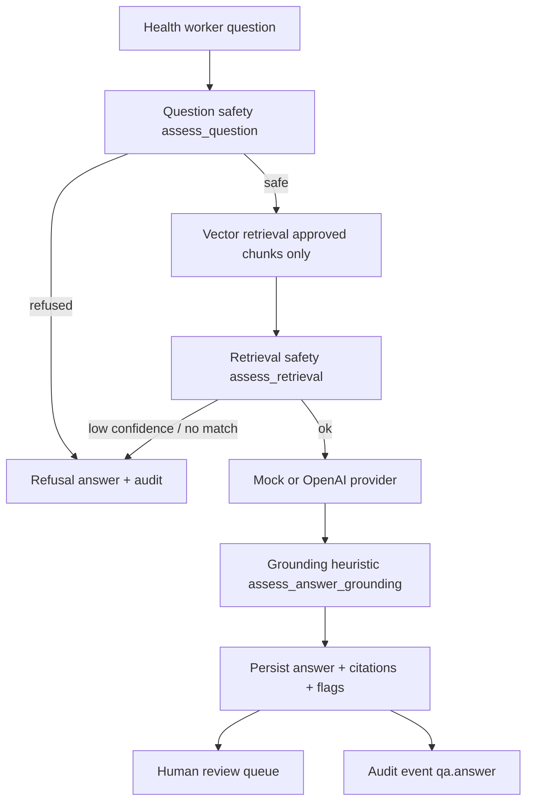

# AI Safety Case — HEP Assist AI RAG Platform

**Status:** Portfolio reference implementation · **synthetic data only** · **not medical advice**

This document describes how AI is layered safely on top of existing health-worker guidance content — the kind of safety narrative expected in Last Mile Health / senior healthcare-AI interviews.

## Design principle: AI on approved content, not open-ended chat

Health workers already follow ministry-approved protocols, pamphlets, and triage checklists. This platform does **not** replace that workflow. It adds:

1. **Retrieval** over indexed approved chunks (English + Amharic examples)
2. **Generation** constrained to retrieved context (mock LLM by default)
3. **Refusal** when the question or retrieval is unsafe/unsupported
4. **Human review** before any answer is treated as usable
5. **Audit trail** for accountability and demo walkthroughs

## Threat model (portfolio scope)

| Risk | Mitigation in this repo | Production gap |
|------|-------------------------|----------------|
| Emergency questions answered by AI | Rule-based pre-check (`emergency_or_urgent_care`) | Certified triage protocols, locale-specific patterns |
| Diagnosis / prescribing requests | Refuse with `diagnosis_request_not_supported`, `prescribing_request_not_supported` | Clinical decision support certification |
| Hallucinated clinical claims | Approved-content-only mode + retrieval threshold + grounding heuristic | NLI/faithfulness models, clinician QA |
| Off-guidance answers shown to workers | Citations required; review queue; refused answers flagged | Auth, RBAC, enforced publish gate |
| PII in logs | Synthetic worker IDs only; preprocessing redaction on legacy notes | HIPAA/GDPR, encryption, retention policy |
| Wrong language / bad translation | Amharic examples with `not_certified_translation` flag | Certified translation pipeline |

## Safety gates (in order)

## Refusal reasons

| Code | Meaning |
|------|---------|
| `emergency_or_urgent_care` | Emergency/urgent pattern detected |
| `diagnosis_request_not_supported` | User asked for a diagnosis |
| `prescribing_request_not_supported` | User asked for prescribing/dosing |
| `no_approved_content_match` | No retrieved chunks |
| `low_retrieval_confidence` | Top score below `RETRIEVAL_MIN_SCORE` |

## Human-in-the-loop review

Every AI answer (including refusals in this demo) enters `review_status: pending`. Reviewers can:

- **approve** — synthetic demo only; no production publish path
- **reject** — answer must not be used
- **request_changes** — documents need for re-generation (not automated here)

Review actions emit `qa.answer.review` audit events.

## Risk and hallucination flags

Examples stored on `ai_answers.risk_flags` / `hallucination_flags`:

- `emergency_detected`, `diagnosis_request`, `prescribing_request`
- `insufficient_retrieval`, `low_retrieval_score`
- `local_language_demo`, `not_certified_translation`
- `possible_ungrounded_content` (token-overlap heuristic on mock path)

Flags inform the UI banner; they do **not** auto-block review in this portfolio build.

## Honest limitations

- **Mock LLM by default** — deterministic templates, not clinical reasoning
- **English-centric safety regex** — limited Amharic unsafe patterns added as examples
- **No authentication** — anyone can review
- **Synthetic guidelines only** — not ministry-approved content
- **Not validated for deployment** — disclaimers on every API response

## Related docs

- [RAG evaluation plan](rag-evaluation-plan.md)
- [Offline-first design](offline-first-design.md)
- [Local language support](local-language-support.md)
- [Deployment runbook](deployment-runbook.md)
- [Interview demo script](interview-demo-script.md)
