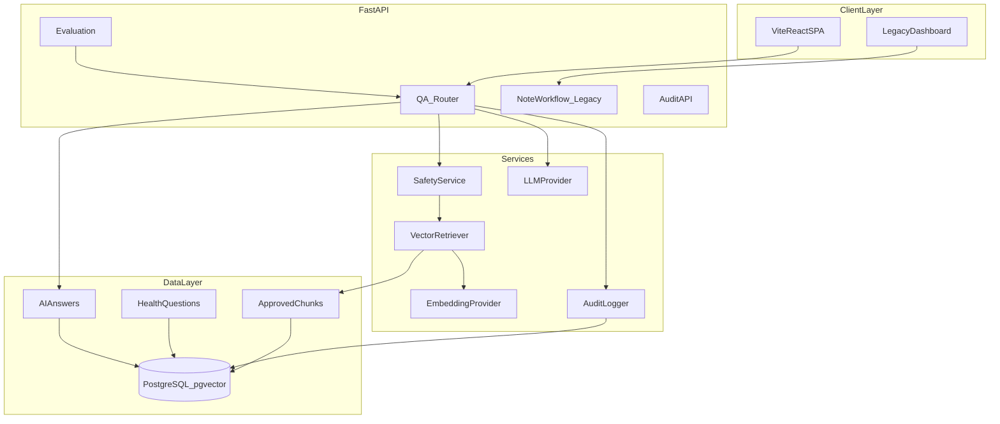

# Architecture — HEP Assist AI RAG Platform

## Problem

Community health workers in low-connectivity settings need quick access to **approved** clinical guidance without unsafe LLM hallucinations. This portfolio demo shows a RAG-based Q&A assistant with human review, safety gates, and audit logging — using **synthetic data only**.

## Components



## Data model

| Table | Purpose |
|-------|---------|
| `approved_content_chunks` | Chunked synthetic guidelines + embeddings |
| `health_questions` | Health-worker questions (EN/AM) |
| `ai_answers` | RAG answers, citations, flags, review status |
| `evaluation_runs` | Batch eval results |
| `clinical_notes` | Legacy synthetic notes |
| `extractions` | Legacy structured extractions |
| `audit_events` | Append-only audit trail |

## Q&A workflow

1. Submit question (`POST /api/v1/questions`)
2. Safety pre-check (emergency / diagnosis / prescribing)
3. Vector retrieval over approved chunks
4. Retrieval confidence check (approved-content-only mode)
5. LLM generation grounded in retrieved context
6. Hallucination heuristic on answer tokens
7. Human review (`POST /api/v1/answers/{id}/review`)
8. Audit event recorded at each answer

## Safety boundaries

- Mock LLM by default; optional OpenAI-compatible provider
- Refuse unsafe question categories before retrieval
- Low retrieval score → refuse in approved-content-only mode
- Not a medical device; does not diagnose or treat
- Synthetic data only

## Deployment

| Environment | Stack |
|-------------|-------|
| Local dev | SQLite + mock embeddings, or Postgres + pgvector |
| Docker Compose | API + pgvector Postgres + nginx frontend |
| CI | pytest + frontend build, mock embeddings |

## Local-language workflow

```
Amharic voice input → STT → language=am
  → retrieve from am-approved chunks (or translate query to en for retrieval)
  → generate answer in Amharic with citations
  → TTS output + human review queue
```

Amharic content in this demo is for architecture illustration, not certified translation.

## Recruiter mapping

Demonstrates vector RAG, healthcare safety gates, human-in-the-loop AI, audit logging, full-stack delivery, and low-bandwidth UX thinking.
