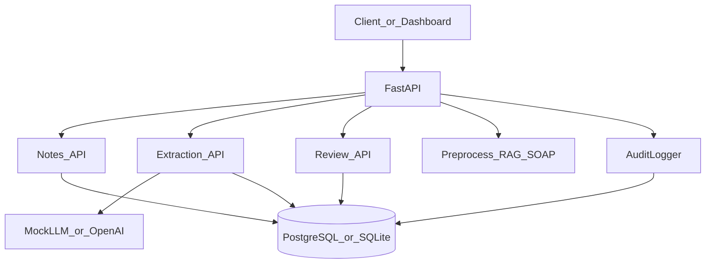

# Architecture — Healthcare AI Workflow Assistant

## Problem

Clinical and administrative teams need a safe way to prototype AI-assisted note processing: structured extraction, risk flags, and mandatory human review before any output is trusted. This portfolio demo shows that workflow using **synthetic data only**.

## Components

## Data model

| Table | Purpose |
|-------|---------|
| `clinical_notes` | Synthetic source notes |
| `extractions` | Structured AI output + review status |
| `audit_events` | Append-only audit trail |

## Review workflow

1. Create note (`POST /api/v1/notes`)
2. Run extraction (`POST /api/v1/notes/{id}/extract`) → status `pending`
3. Human review (`POST /api/v1/extractions/{id}/review`) → `approved` / `rejected` / `changes_requested`
4. Dashboard aggregates counts (`GET /api/v1/dashboard/summary`)

## Safety boundaries

- Mock LLM by default; optional OpenAI-compatible provider via env vars
- No real patient data; disclaimers on all clinical outputs
- Not a medical device; does not diagnose or treat

## Deployment

- Local: `uvicorn` + SQLite default
- Docker Compose: API + PostgreSQL 16
- Seed: `PYTHONPATH=backend python -m app.scripts.seed`

## Recruiter mapping

Demonstrates FastAPI, PostgreSQL/SQLModel, structured extraction, human-in-the-loop AI, audit logging, Docker, and healthcare data safety awareness.
