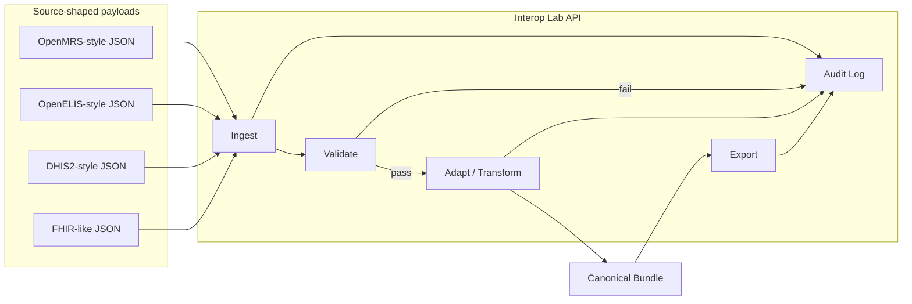

# Interoperability Map

Synthetic lab architecture for Dawit's healthcare interoperability modernization portfolio.

## Purpose

Show how data moves between **source-shaped payloads** (inspired by real open-source ecosystems) and a **canonical internal model** suitable for downstream analytics, exports, or future FHIR gateways — without claiming production connectivity to those systems.

## High-level flow

## Canonical bundle (internal)

| Section | Contents |
|---------|----------|
| `patients` | Normalized demographics + identifiers |
| `encounters` | Visit metadata + observations (from OpenMRS-style) |
| `lab_results` | Accession-linked results (from OpenELIS / Observation) |
| `aggregate_reports` | Program indicators (from DHIS2-style) |
| `fhir_resources` | Original FHIR resources preserved when applicable |

## Adapter responsibilities

| Adapter | Reads | Writes to canonical |
|---------|-------|---------------------|
| OpenMRS | `uuid`, `person`, `encounters[].obs` | `patients`, `encounters` |
| OpenELIS | `accessionNumber`, `testResults[]` | `lab_results`, stub `patients` |
| DHIS2 | `dataSet`, `dataValues[]` | `aggregate_reports` |
| FHIR | Patient, Observation, Bundle | `patients`, `lab_results`, `fhir_resources` |

## Validation gates

1. **Required fields** — source-specific minimum schema
2. **Invalid dates** — birth dates, collection dates, effectiveDateTime
3. **Duplicate IDs** — unique `(source, external_id)` in database
4. **Missing lab fields** — `testCode`, `testName`, `resultValue` for OpenELIS; value for Observation

## Audit events

| Action | When |
|--------|------|
| `payload_received` | Message persisted |
| `validation_passed` / `validation_failed` | After schema checks |
| `transformed` | Canonical bundle stored |
| `exported` | Canonical JSON export completed |

## Relationship to Bahmni

**Bahmni** is an OpenMRS distribution with OpenELIS integration in real deployments. This lab does not run Bahmni. The OpenMRS-style adapter demonstrates the **kind of patient/encounter/obs JSON** integration engineers customize around Bahmni stacks — middleware, validation, and audit — rather than Bahmni core development.

## What this is not

- Not a national HMIS
- Not a certified FHIR server
- Not a replacement for OpenMRS, OpenELIS, or DHIS2
- Not connected to real facilities

## Code locations

| Component | Path |
|-----------|------|
| API routes | `backend/app/api/interop.py` |
| Adapters | `backend/app/interop/adapters.py` |
| Validators | `backend/app/interop/validators.py` |
| Service orchestration | `backend/app/interop/service.py` |
| Synthetic samples | `backend/app/interop/synthetic_data.py` |
| Dashboard | `backend/app/static/interop_dashboard.html` |
