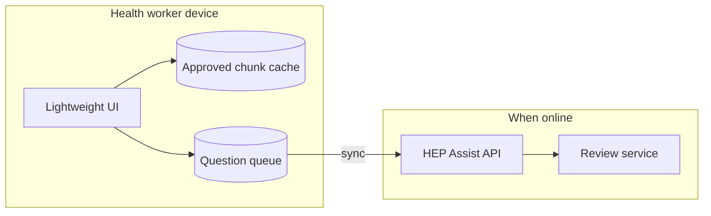

# Offline-First Design — HEP Assist AI

**Portfolio architecture notes** · not fully implemented in this repo

Community health workers often operate with intermittent connectivity. This document describes how the current demo anticipates offline-first deployment without overclaiming what is built today.

## What exists today

| Capability | Status |
|------------|--------|
| Lightweight React UI (system fonts, minimal assets) | Implemented |
| Paginated API, health probes | Implemented |
| Approved content chunks in database | Implemented (seeded) |
| Mock embeddings (no network for inference) | Default |
| Offline content cache on device | **Not implemented** |
| Background sync queue | **Not implemented** |
| Service worker | **Not implemented** |

## Target architecture

## Offline read path

1. On first sync (or USB sideload in low-bandwidth programs), download **approved chunk pack** — titles, summaries, chunk IDs, embeddings (quantized).
2. Worker asks question → **local retrieval** over cached embeddings (same scoring as server).
3. If top score ≥ threshold, show **cited excerpt** from cache without calling LLM.
4. Optional: on connectivity, send question + local retrieval metadata for server-side answer generation and review.

## Offline write path

1. New questions stored in `IndexedDB` / SQLite with `sync_status: pending`.
2. When online, `POST /questions` + `/answer` with idempotency key.
3. Review status pulled on sync; worker sees banner until approved.

## Low-bandwidth UI choices (implemented)

- No heavy chart libraries on critical paths
- Text-first answer view with collapsible citations
- `details` block on home page for offline notes
- Docker image can run entirely on LAN without external APIs (mock LLM)

## Content freshness

| Strategy | Use case |
|----------|----------|
| Versioned chunk packs (`v0.2`) | Ministry publishes quarterly updates |
| TTL + stale banner | Field device shows "content may be outdated" |
| Diff sync | Only changed chunk IDs downloaded |

## Security offline

- Encrypt cache at rest on shared devices
- No real PHI in this portfolio; production requires key management
- Tamper-evident pack signatures before loading chunks

## Implementation roadmap

1. Export endpoint: `GET /api/v1/content/pack` (chunk JSON + embeddings)
2. Service worker caching shell + API stale-while-revalidate
3. Client-side `VectorRetriever` port (WASM or lightweight JS)
4. Sync worker with exponential backoff
5. SMS/USSD fallback for citation excerpt only (architecture discussion)

## Related

- [Local language support](local-language-support.md)
- [Deployment runbook](deployment-runbook.md)
